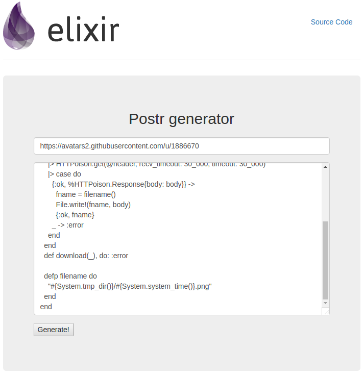

# Postr

[Postr](http://postr.techgaun.com/) is a very simple phoenix app based on the information from [Pete Corey's ElixirPoster](http://www.east5th.co/blog/2017/02/13/build-your-own-code-poster-with-elixir).
All thanks to Pete Corey as he did the hard job of determining ratios and scaling that I used here.

- Postr uses Imagineer under the hood but I avoided use of xml_builder and instead built the SVG manually so as to make it little faster.
- If imagemagick is installed, it will automatically rescale image to 1.667x1

### Up and Running

- `git clone git@github.com:techgaun/postr.git`
- `cd postr`
- `mix deps.get`
- `mix phoenix.server`
- Go to http://localhost:4000
- Enter the URL of image (PNG) and put source code you want in the poster.
- A file `out.svg` will be downloaded once the SVG is generated.
